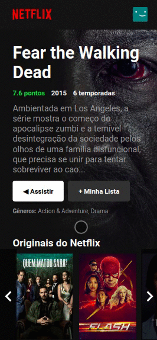

# Netflix clone
Direito de imagens para a [Netflix](https://www.netflix.com/br/)

  
  
  #### Responsive
  

  
  
## TOOLS

`React` `JavaScript` `HTML` `CSS` `Vscode` `Heroku`

 ## Sobre o projeto
  
  O projeto foi desenvolvido para fins educativos em [React](https://pt-br.reactjs.org/), [Heroku](https://www.heroku.com/) e também servirá como portfolio. Direito de imagens para a [Netflix](https://www.netflix.com/br/), imagens e informações foram obtidas via api da plataforma [The movie DataBase](https://www.themoviedb.org/).
  
  Fico muito feliz caso vocês tenham algum feedback sobre o projeto, estrutura, código ou qualquer outra coisa que você poder me reportar que me faça ser um desenvolvedor melhor.
  
  #### Contato
  
  Email : cicerojonyedison@gmail.com
  
  Entre em contato com [Linkedin](https://www.linkedin.com/in/cicero-jonyedson-896088160/)
  
  ## Observações sobre o projeto
  
  1. Os botões de assistir e adicionar na lista não estão implementados ao clicar a paginas será atualizada.
  2. Não está implementado os avatares/perfis.
  
  
